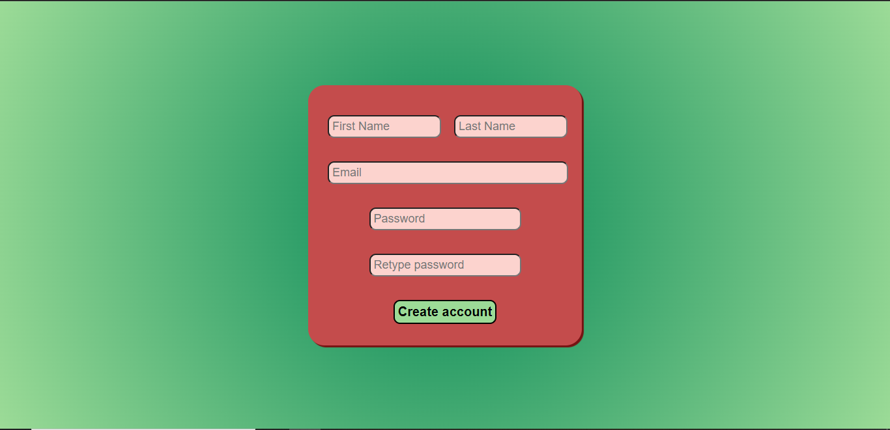
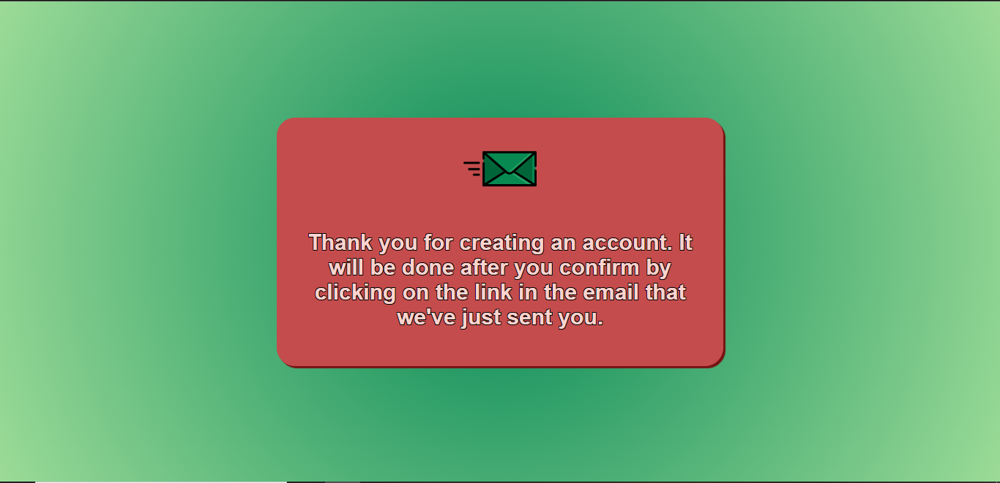
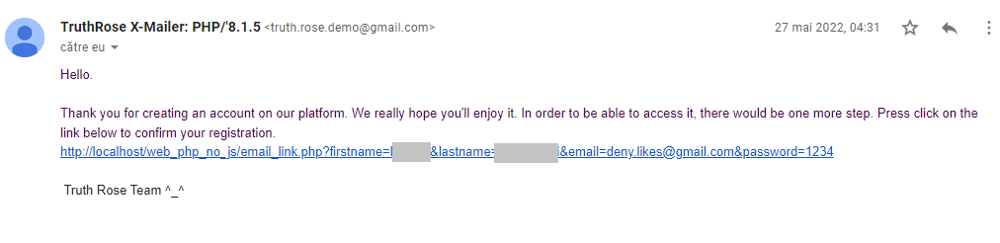
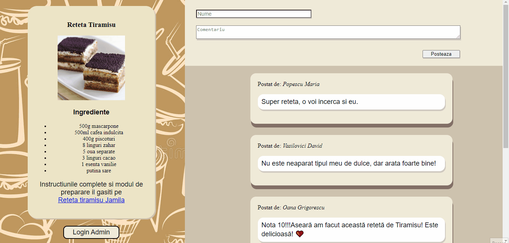

# Web Applications *`mock versions`*

These little projects were part of my homework in Web Programming Course.

*Client-side web technologies:*
>HTML

>CSS

*Server-side web technologies:*
>PHP

## Social media

Users can create accounts/login on this page. After they create an account, they will receive an email confirmation. Once logged in, an user can post photos, delete them and see a feed which contains all the photos uploaded by all users.

***App preview***
###### Create account page

###### After creating account message

###### Confirmation email

###### Login and posting photos

----

## Recipe review

Users can leave reviews for a recipe. Before being posted, an admin must approve or reject those reviews. The admin has its login credentials (not everyone can manage posted reviews).

***App preview***

